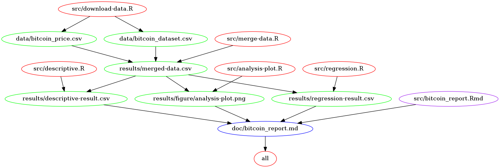

# Bitcoin-analysis

_Author_: Xinbin Huang

_Last updated_: Dec 16, 2017

## Project Overview

The value of _Bitcoin_ has increased a lot since it was invented. Also, more and more people are interested in investing in _Bitcoin_. It seems interesting to investigate the factors that affect the price.

This project performs a simple analysis on the effect of two factors on _Bitcoin_ price.

## File structure

- `data` : raw data (two CSV files `bitcoin_price.csv` and `bitcoin_dataset.csv`)
- `src` : code files and analysis scripts (`.R`, `.Rmd`)
- `results` : rendered documents and generated analysis results
- `doc` : rendered report (`bitcoin_report.md`)

## Research Question

 - Does the difficulty to find a new block affect the price of _Bitcoin_?
 - Does the volume of the _Bitcoin_ affect the price of _Bitcoin_?

## Hypothesis

- The price of _Bitcoin_ would be higher with increasing difficulty to find a new block because lower supplies (new blocks) makes _Bitcoin_ more valuable.
- The volume of the _Bitcoin_ would positively affect the price of _Bitcoin_ because higher the volume, more investors would like to buy it.

### Data

> The dataset includes the historical price and features data of the cryptocurrency _Bitcoin_. It is retrieved from Kaggle [Cryptocurrency Historical Prices](https://www.kaggle.com/sudalairajkumar/cryptocurrencypricehistory)

- The downloaded files are located in `data` folder.
  - `bitcoin_dataset.csv`: include some features describing the _Bitcoin_
  - `bitcoin_price.csv` : include price information about the _Bitcoin_
- There are two `.csv` files (`features.csv` and `price.csv`) in the `results` folder for testing purposes.

#### variables
- `Date` record the date from 2013-4-28 to 2017-11-07.
- `Close` is the daily closing price of _Bitcoin_ from 2013-4-28 to 2017-11-07.
- `btc_difficulty` is a relative measure of the difficulty in finding a new block.
- `Volume` is the volume of transactions on the given day.

## Analysis Overview

I generated a pair-plot with the variables `Close`, `btc_difficulty` and `Volume` to first explore their relationship. Then I will run a linear regression model to see if latter two variables affect the _Bitcoin_ price. The following part is the procedure to reproduce the analysis.

## Data analysis pipeline

Dependencies diagram for the analysis piepline

## Usage

Get Docker Image:
> `docker pull xhuang09/bitcoin-analysis`

Clone the repo:

For HTTPS:
> `git clone https://github.com/xinbinhuang/bitcoin-analysis.git`

For SSH:
> `git clone git@github.com:xinbinhuang/bitcoin-analysis.git`

Run the Docker Image:
> docker run -it --rm -v YOUR_LOCAL_DIRECTORY_OF_CLONED_REPO/:/home/bitcoin-analysis xhuang09/bitcoin-analysis  /bin/bash

Change Directory:
> `cd home/bitcoin-analysis/`

To clean previously outputted files:
> `make clean`  

To run the project:    
> `make all`  
