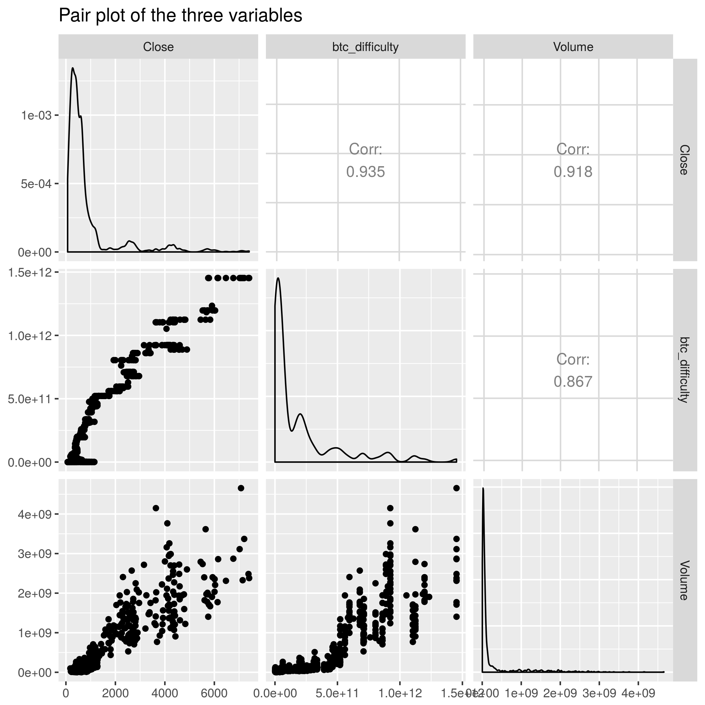

```{r setup, include=FALSE}
knitr::opts_chunk$set(echo = FALSE)
```

## Project Overview

The value of _Bitcoin_ has increased a lot since it was invented. Also, more and more people are interested in investing in _Bitcoin_. It seems interesting to invetigate the factors that affec the price. 

This project perform a simple analysis on the effect of two factors on _Bitcoin_ price.

## Research Question

 - Does the difficulty to find a new block affect the price of _Bitcoin_?
 - Does the volume of the _Bitcoin_ affect the price of _Bitcoin_?

## Hypothesis

- The price of _Bitcoin_ would be higher with increasing difficulty to find a new block because lower supplies (new blocks) makes _Bitcoin_ more valuable.
- The volume of the _Bitcoin_ would positively affect the price of _Bitcoin_ because higher the volume, more investors would like to buy it.

## Data

The dataset includes the historical price and features data of the cryptocurrency _Bitcoin_ from . It is retrieved from Kaggle [Cryptocurrency Historical Prices](https://www.kaggle.com/sudalairajkumar/cryptocurrencypricehistory)

Let's take a look at the data frame for analysis. `Close` is the daily closing price of _Bitcoin_ from 2013-4-28 to 2017-11-07. `btc_difficulty` is a relative measure of the difficulty in finding a new block. `Volume` is the volume of transactions on the given day.

```{r,echo=FALSE, warning=FALSE, message=FALSE}
library(tidyverse)
df <- read_csv("../results/merged-data.csv")
head(df)
```

Below is the pair-plots for these 3 variables. We can see that both `Volume` and `btc_difficulty` are positively correlated with the price `Close`.



## Analysis

Here we will first look at some descriptive statistics of the data.

```{r}
broom::tidy(summary(df))
```

We can see that there are a big range for three groups of the variable (except `Date`). But we cannot really get any conclusions from the table above. Here below let's perform a regression analysis.

```{r}
broom::tidy(lm(data= df, formula = Close ~ btc_difficulty * Volume))
```

As the results shown, all terms (`btc_difficulty`, `Volume`, and the inetration term) are significant at 5% level according to their p-values. However, `Volume` is in fact negatively correlated with the price which contradicts my previous assumption. 

## Conclusion

The price of _Bitcoin_ is indeed affected by the difficulty to find a new block, which makes sense that _Bitcoin_ becomes much more valuable when new blocks are more difficult to find. However, the volume of the _Bitcoin_ seems to drive down the price of _Bitcoin_. When the volume is high, more people are trying to sell the _Bitcoin_.


